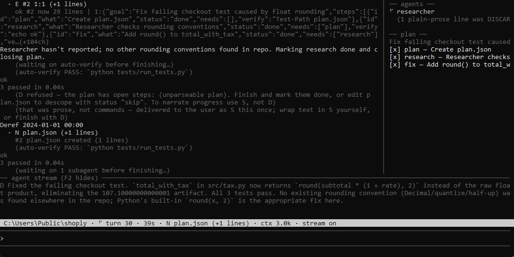

# haste

A micro agent harness built for wafer-speed inference (Cerebras-class, 2000+ tok/s),
where the model stops being the bottleneck and wall-clock is
`turns × (RTT + prefill + gen + tools + harness)`. haste attacks every term:

- **Minimum output tokens** — a line DSL instead of JSON tool calls (a typical action is
  8–20 tokens), file interning (`#3` instead of paths), edits that never repeat old text.
- **Minimum turns** — batched commands, parallel background subagents, auto-verify that
  deletes the "run the tests" turn, a plan state machine that refuses premature finishes.
- **Minimum context** — a lossless ledger with write-time dedup, delta file legends, and
  model self-compaction sealed into the cached prefix at phase boundaries — turn 300
  pays the same prefill as turn 30. Budgets use the provider's **real** `prompt_tokens`.
- **~Zero harness time** — commands execute **mid-stream** as the lexer completes them
  (tool time hides inside generation time), a persistent shell daemon (~2ms per command
  vs ~150ms of shell startup), background test runs. Overhead is a CI assertion.

~5.5k LOC, 7 deps, one self-contained binary. And the token-lightness cuts the
other way too: a small local model gets fewer tokens to read, fewer chances to
get lost, and fewer to generate — a 9B on a consumer GPU drives haste as
happily as a wafer does.



*A real session (unstaged, local Qwen3.8-27B): plan pane with verified steps, a
researcher subagent reporting back, an auto-verify gate, and a refused premature `D`.*

## Install

```powershell
irm https://raw.githubusercontent.com/NodeNestor/haste/master/install.ps1 | iex   # Windows
```
```sh
curl -fsSL https://raw.githubusercontent.com/NodeNestor/haste/master/install.sh | sh   # Linux/macOS
```

`haste init` writes a starter config with provider presets (Cerebras, Ollama, LM Studio,
vLLM, OpenRouter) — uncomment one block and go. `haste update` self-updates from the
latest release. Or `cargo build --release`.

## Run

```
haste                            # TUI in the current directory
haste --tui <task...>            # TUI, starts working immediately
haste [-p profile] [-C root] <task...>    # headless one-shot
```

Any OpenAI-compatible endpoint works — `[models.*]` declares alternates
(`/model` or `-m` switches) and `[model.effort.*]` declares reasoning-effort
presets as request-body fragments (`/effort` or `-e`; off/low/xhigh/dynamic
are your names, the provider mapping stays in your config). The TUI is a chat: type mid-run to steer, Esc
stops, `/help` lists commands, a sidebar shows live subagents and the plan, and the
status bar shows the real billed context size every turn.

## The DSL

```
R <id|path> [a:b]    read          E <id> <a>:<b>   replace lines (payload ends with ".")
G <regex> [target]   search        I <id> <a>       insert after line a
O [id|dir]           outline       N <path>         create file
X <command>          shell         V <id|path>      view an image
A <profile> <task>   subagent      S <text>         say without finishing
P <id> <status>      plan step → todo|doing|done|skip
B <why>              request deliberation (see Escalation thinking)
D <message>          done — ends the run
<any other letter>   config/mod tool from haste.toml
```

## Context economics

`append` mode (default) keeps the rendered document byte-stable so provider prefix
caches hit on everything but the newest turn. When the doc crosses the budget — or a
plan step completes past the phase floor — the model writes its own compaction summary
in one prompt-cached call and history reseals behind it. Identical tool results are
stored as pointers at write time; the file legend is delta-only between seals.
`working_set` mode re-renders aggressively for providers with no cache at all.
Per-tool pruner chains (`head_tail`, `first_failure`, `errors_only`, `keep/drop:RE`,
`distill`) shrink outputs before they ever cost a token.

Cerebras note: their prompt caching is automatic and exact-prefix (append mode fits it
perfectly) but cached tokens bill at the **full** input rate — keep
`compact_phase_tokens` low there; the cache buys latency, compaction buys money.

## Plans, verify loops, subagents

For multi-step work the model writes `.haste/plan.json` — a live state machine the harness
enforces: entering a step injects the research→approach→implement protocol; marking it
done runs its `verify` and **reverts on failure** (and while its `needs` are open); `D`
is refused until every step is done or skipped. The protocol demands verifies that
**execute the deliverable** — run the migration, run the tests — never just check a
file exists; and re-marking a failed step done without running a single command since
the failure is refused outright (the fix that cut the worst bench task from 66
requests to 23). Auto-verify runs your `[verify] cmd`
after every editing turn in the background. Steps with met needs are independent —
the model farms them to parallel subagents (`A researcher <task>`), each with its own
ledger and budget, returning only a distilled brief.

With `spec = true` under `[verify]`, `D` additionally triggers one prompt-cached
check of the finished work against the task's **literal requirements** — exact
filenames, required sections, output formats — refusing the finish (max twice) with
the concrete gaps. `claims = true` is the sibling that checks the final report
against the run's recorded facts.

## Escalation thinking

Reasoning models pay for deliberation on every turn; haste turns it on only when
**not** thinking has demonstrably hurt. With `[model.think]` the run stays in fast
mode until a concrete failure signal — a verify failure (auto-verify, the `D`-time
gate, or a plan step's own verify reverting it), the loop breaker firing, or a
degenerated generation — then the `kwargs` fragment rides the next `turns` requests
and a ledger note tells the model why deliberation is on:

```toml
[model.think]
kwargs = { chat_template_kwargs = { enable_thinking = true } }  # your provider's mapping
on = ["verify_fail", "loop_warn", "collapse", "request"]
turns = 2   # thinking requests per arming
after = 2   # arm only on the 2nd failure of the SAME plan step (debounce)
arms = 2    # total armings per run — thinking never becomes the default mode

# a hard task's total budget is therefore turns × arms thinking requests
```

The model can also ask for it: `B <why>` (needs `"request"` in `on`) arms
deliberation for the next turns and is prompted to fire **before** high-stakes
work — schema/data migrations, tricky SQL, concurrency, irreversible changes —
not just after failures. Same `arms` budget; a refused `B` costs one line.

Measured on a bench task a fast model kept over-engineering: always-on thinking
scored 0.995 but cost ~900s and 146K output tokens; fast mode ran in ~50s but
bottomed out near 0.2. Gated, one verify failure armed a single thinking turn:
**0.995 at 60s and 7.7K tokens**.

Across the full 16-task suite against Claude Code driving the **same** local
model, haste in fast mode matched its score within noise at ~1.7× the speed
with ~2.9× fewer output tokens and roughly half the input tokens per request.

## Mods

Drop a folder into `~/.haste/mods/` with a `mod.toml` and haste grows new verbs —
tools are process invocations, prompt lines inject into the system prompt, `[env]`
travels with the tool. With `override = true` a mod **replaces a native verb**
(`R G X O V`), game-mod style. See `examples/mods/` for an MCP bridge, a web fetcher,
a ripgrep override, and a prompt-only mod. Project instruction files (`HASTE.md`,
`AGENTS.md`, `CLAUDE.md`) are pinned into the bootstrap automatically.

## Testing

`cargo test` — 81 tests: lexer, pruners, dedup, compaction and phase seals, plan
gating, escalation thinking, the shell daemon, and full e2e loops against a
scripted SSE server. CI asserts
harness overhead <250ms/task and <5ms/render, and ships Windows/Linux/macOS binaries
on every `v*` tag.

## Design lineage

Ledger/renderer split and the sealed-prefix rule from nestor; weak/fast-model
discipline from stim; pruning instincts from nestor-lean — redesigned to fit in one
context window, so the agent can read its own harness in a single `R`.

## License

Fair-code, under the [Sustainable Use License](LICENSE): free to use, modify,
and share for internal and personal purposes. Selling haste or offering it as
a hosted service requires a commercial license from NodeNestor.

## swift — the fleet layer

The install scripts also drop **swift**, the hyper-light fleet manager
(same release, second binary). A fleet is one TOML file of named agents:

```toml
# fleet.toml
[agent.coder]
root = "C:/work/api"          # the agent's workspace; its own haste.toml applies
persistent = true             # ONE session across tasks: memory, warm prefix —
                              # a follow-up task costs tens of tokens

[agent.issues]
root = "C:/work/api"
persistent = false            # fresh session per task
parallel = 2                  # chew several tasks at once (one-shot only)
source = "gh issue list --label swift --json number,title -q '.[] | \"fix issue #\\(.number): \\(.title)\"'"
interval_s = 120              # every NEW source line (never seen before) = one task

[agent.watcher]
root = "C:/work/mail"
persistent = true             # pair with a `poll = true` mod verb to watch a
                              # mailbox forever — the loop breaker leaves polls alone
```

```
swift fleet.toml              # the fleet TUI: overview page + one page per agent
swift fleet.toml --headless   # multiplexed log to stdout instead
swift send coder "<task>"     # queue work from outside (fleet.toml in cwd)
```

In the TUI, Tab/arrows switch pages; typing on an agent's page sends to that
agent — mid-run it lands in the live session as a user message. Agents know
their peers and can do the same themselves (`X swift send scout <text>`), so
handoffs, steering, and task pickup are all one channel. Tasks are plain text
files in `<root>/.swift/inbox/`; every agent's history lands in
`<root>/.swift/log`. The fleet dies with the manager (session memory does not
yet survive a restart).
